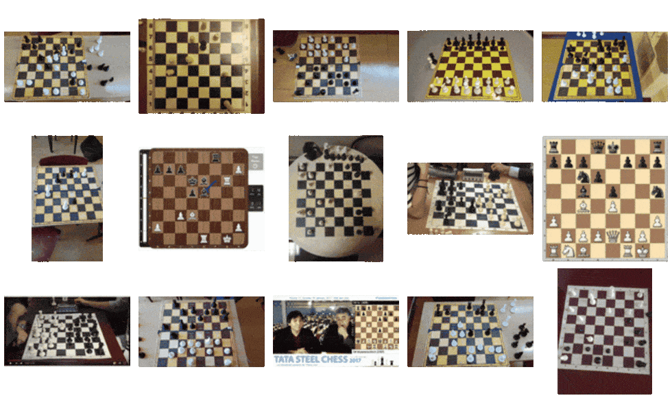
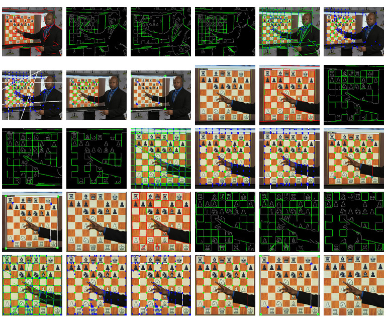
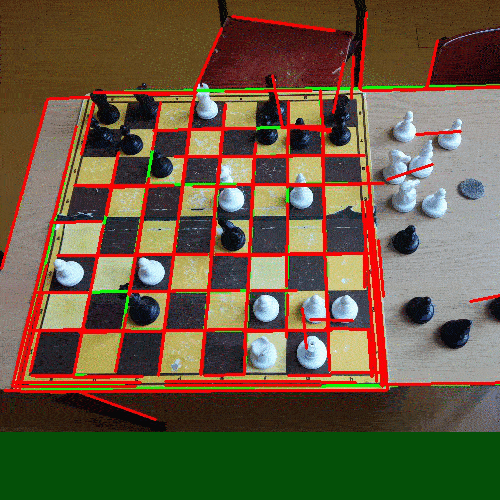

## Clay stuff
docker run -it chess_container /bin/bash

docker run -it --mount src="$(pwd)",target=/test_container,type=bind chess_container /bin/bash

python3 main.py detect --input="clayboards/IMG_1353.jpg" --output="clayboards_out/board_1353.jpg"


pip3 install -r requirements.txt   # toolkit for machine learning

python3 dataset.py
python3 train.py 50

python3 main.py test

python3 main.py detect --input=photo.jpg --output=board.jpg
python3 main.py detect --input="clayboards/IMG_1353.jpg" --output=board.jpg


gcloud builds submit --tag gcr.io/chessboard-classification/board-fitter --timeout=86399
gcloud beta run deploy --image gcr.io/chessboard-classification/board-fitter --platform managed

## ♔ Neural Chessboard ♔

An Extremely Efficient Chess-board Detection for Non-trivial Photos

[arxiv:1708.03898](https://arxiv.org/abs/1708.03898)



> _Computer Vision! Machine learning! A E S T H E T I C!_

## Getting Started

__Dependencies Installation (macOS):__
```
$ brew install opencv3               # toolkit for computer vision
$ pip3 install -r requirements.txt   # toolkit for machine learning
```

__Dataset & Training:__
```
$ python3 dataset.py
$ python3 train.py 50
```

__Testing:__
```
$ python3 main.py test
```

__Example:__
```
$ python3 main.py detect --input=photo.jpg --output=board.jpg
```

__Producing FEN:__
> NON-PUBLIC ALGORITHM
```
$ python3 fen.py --input=board.jpg
```

__Dependencies:__

- [Python 3](https://www.python.org/downloads/)
- [Scipy 0.19.1](https://www.scipy.org/)
- [OpenCV 3](http://opencv.org/)
- [Tensorflow](https://www.tensorflow.org/) (with [tflearn](https://github.com/tflearn/tflearn) support)
- [Pyclipper](https://github.com/greginvm/pyclipper)

----

**Raw Process:**



**BONUS (old gif):**


